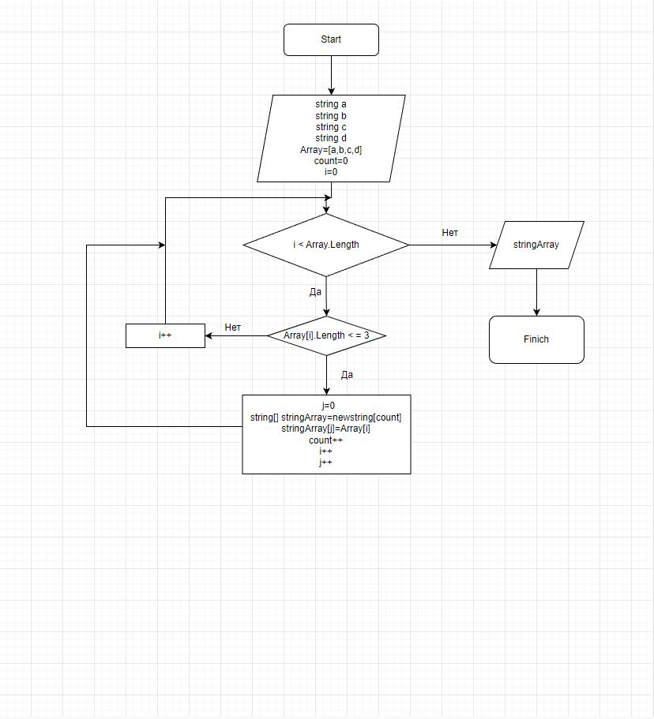

1. Написал метод задания массива ручным вводом с консоли(сначала задается размер массива)
2. Написали метод печати массива
3. Написали метод решения поставленной задачи
4. Составленная блок схема прилагается 
